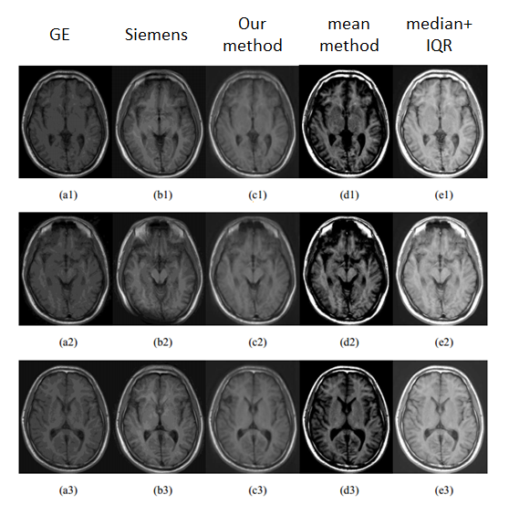
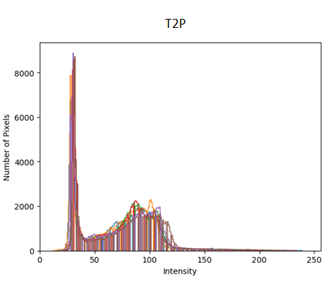
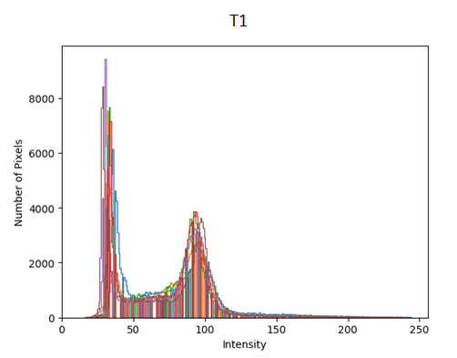
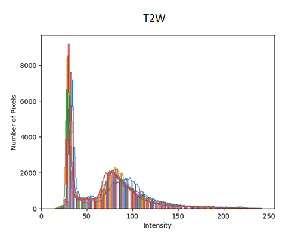
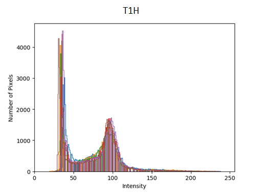
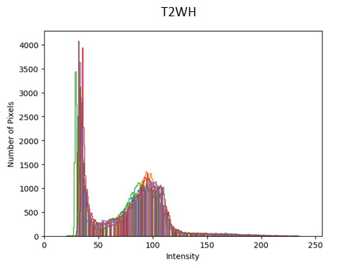

# Intensity-Normalization-with-CycleGAN

This code is used for intensity normalization of medical images and is roughly divided into image preprocessing, CycleGAN training and predictive image (CycleGAN are built on the top of CycleGAN-Tensorflow and can be download from 'https://github.com/vanhuyz/CycleGAN-TensorFlow') and imaging quality assessment.

All ideas and methods of this code are proposed in this paper(https://ieeexplore.ieee.org/abstract/document/8625388). If you want to use the code, please quote this paper first.

## Environment

* TensorFlow 1.0.0
* Python 3.6.0

## Datasets

* datasets/IMAGES_OF_GE Ten patients images from GE scanners
* datasets/IMAGES_OF_XI Ten patients images from Siemens scanners
* I have deleted it because of privacy

## Pretrained models
My pretrained models are available at https://github.com/hzy5660251/Intensity-Normalization-with-CycleGAN/tree/master/pretrained

## Data preparing

* First, we performed SIFT image matching

```
python SIFT.py
```

* Then, we did image random cropping

```
python random_crop.py
```

* Write the dataset to tfrecords

```
python build_data.py
```

## Training

```
python train.py
```

if you don't want to use histogram_loss, set the learning rate to zero in model.py

## Export model

You can export from a checkpoint to a standalone GraphDef file as follow:

```
python export_graph.py
```

## Test

```
python test.py
```
## Backprop test
Because I added the new LOSS(histogram_loss), I used the following procedure to verify if the new loss can be backpropagated

```
python backprop_test.py
```
## Draw histogram results

```
python draw_histogram.py
```

## Result evaluation

```
python evaluation_criteria.py
```

```
caculate_gmsd.m (in MATLAB)
```

## Results on test data
### Images results

 
### Histogram results

* T2P=T2 PROPELLER(T2W BLADE)
* T1=T1W FLAIR(T1 FLAIR)
* T2W=T2W FLAIR(T2 FLAIR)
* T2PH(After adding the histogram_loss)
* T1H(After adding the histogram_loss)
* T2WH(After adding the histogram_loss)

 

 
 



## Contributing
Please open an issue if you have any trouble or found anything incorrect in my code :)

## Acknowledgments
In this study, I only made a small part of the code. If you want to use the code, please quote the original paper(https://ieeexplore.ieee.org/abstract/document/8625388) and source code(https://github.com/vanhuyz/CycleGAN-TensorFlow).

